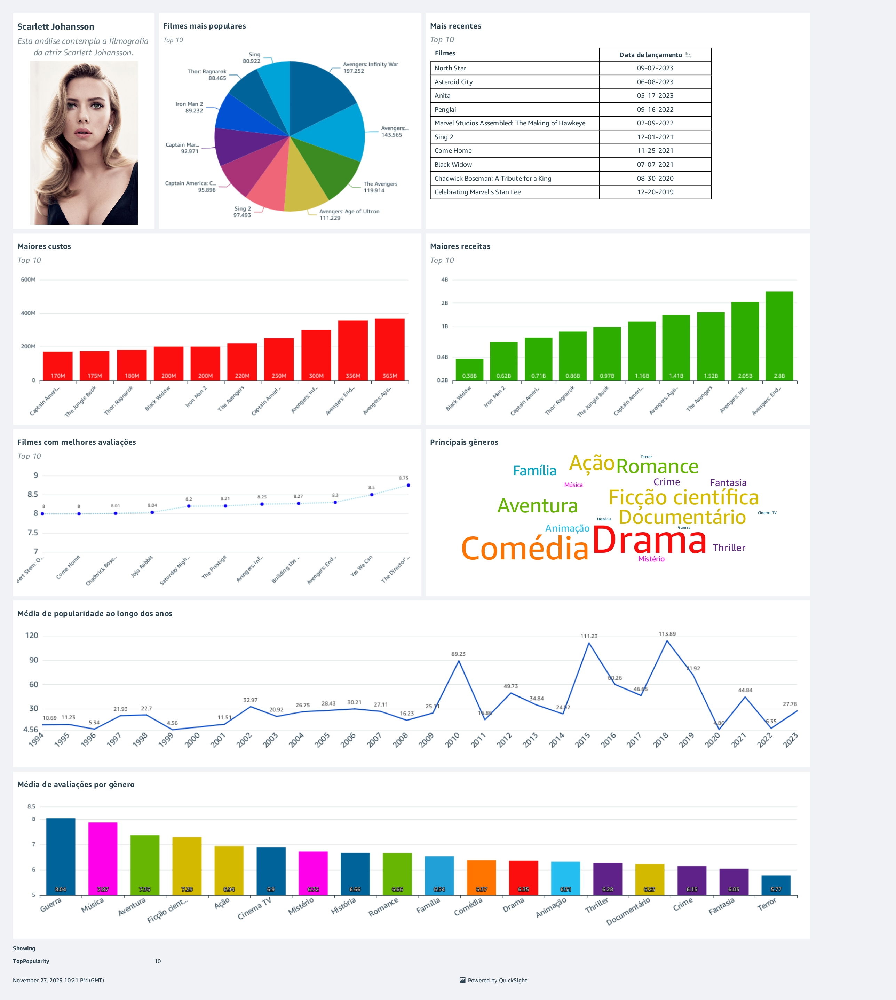

# Projeto: Análise de Filmes com Scarlett Johansson

## Descrição:
Este projeto consiste na análise de dados sobre a atriz Scarlett Johansson, utilizando dados extraídos de uma API e arquivos CSV. O objetivo é realizar processos de ETL para transformar e analisar os dados, resultando na criação de um dashboard informativo.

## Tecnologias envolvidas:
- API TMDB: Para obter informações detalhadas sobre filmes.
- Pandas: Biblioteca para auxliar na manipulação de dados.
- Docker: Ambiente de execução para scripts Python para a extração.
- AWS S3: Armazenamento dos dados em diferentes camadas (raw, trusted, refined).
- AWS Lambda: Processamento dos dados e comunicação com a API TMDB.
- AWS Glue: ETL para limpar e transformar os dados.
- Athena: Execução de queries sobre os dados armazenados.
- QuickSight: Criação de dashboards para visualização dos dados analisados.

➡ Passo a passo do projeto e como foi construído está no **[arquivo Etapas](Etapas.md)**.

### Resultado:

  

